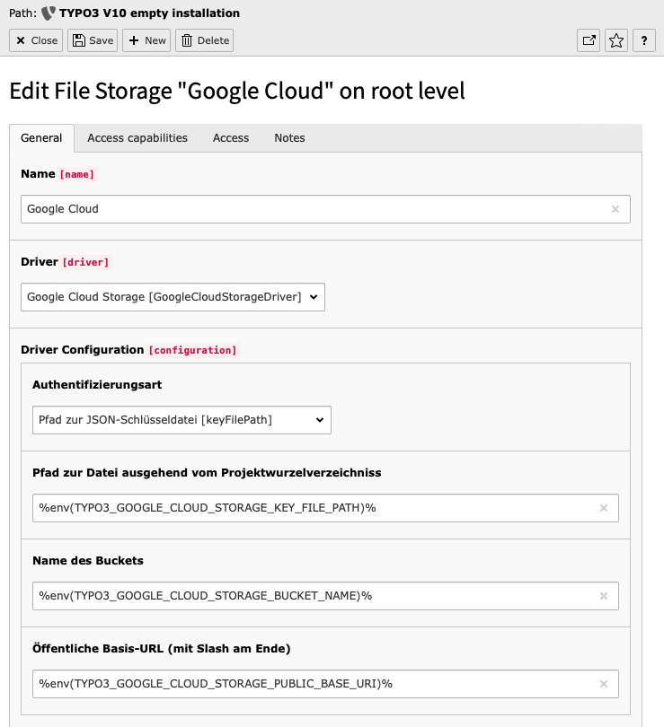

# TYPO3 Google Cloud Storage FAL driver.

This FAL (FileAbstractionLayer) driver allows you to use Google Cloud Storage Buckets in TYPO3 for your assets instead of a local file system. It relies on ```google/cloud-storage``` library to connect to Google.

**Features:**
- Full support of all operations (rename, copy, move, folders, files e.g.).
- Full support of "\_recycler\_" folder.
- Supports multiply buckets & multiply service accounts.
- Stores processed images in google cloud storage.
- Google login credentials can be configured by JSON, ENV or TYPO3 backend.
- Supports base URL configuration per bucket (e.g. for https://cdn.projectname.com/). 
- Supports direct to google storage added files (without using Filelist module).
- Simulates folders, even if google cloud storage is a flat filesystem.
- It comes with caching strategy for higher performance. 

It gives you the power to use TYPO3 "cloud native" instead of "cloud ready" on Google Cloud Platform (GCP).

# Installation

The extension should be installed via Composer

```
composer require nextmotion/google-cloud-storage-fal
```

## Configuration

## Google Cloud Storage Configuration

First of all you have to create a bucket on google cloud platform. Second you have to create a private/public key to access the bucket. This driver only supports accesses on a uniform bucket level. 

### CORS Header

To use the TYPO3 crop editor, the CORS headers of the bucket must be configured.

Create a file CORS.json and modify to your needs:  
```
[
    {
      "origin": ["*"],
      "method": ["GET", "POST", "OPTIONS", "HEAD"],
      "responseHeader": ["Authorization", "Origin", "X-Requested-With", "Content-Type", "Accept"],
      "maxAgeSeconds": 3600
    }
]
```

***Warning***: `"origin": ["*"]` means wide open configuration. It's more secure to define your domains e.g. 
`"origin": ["subdomain.domain.tld", "local.dev" ... ] `


Use the command `gsutil cors` to configure CORS in a bucket:
```
# Log-in into your account.
gcloud auth login [MY_ACCOUNT]

# List your projects
gcloud projects list

# Choose project
gcloud config set project [PROJECT_NAME]

# List your buckets
gsutil ls

# Update CORS of your bucket
gsutil cors set CORS.json gs://[BUCKET_NAME]
```

If you want to remove CORS, see: https://cloud.google.com/storage/docs/configuring-cors#remove-cors-bucket

## TYPO3 Configuration

First create a [file storage](https://docs.typo3.org/m/typo3/reference-coreapi/master/en-us/ApiOverview/Fal/Administration/Storages.html).

All configuration fields supports `%env(ENV_VALUE_NAME)%` syntax. 

### Using key file



### Using key file content


## Local `1:_processed_` vs. remote `_processed_` images

It's up to you and depends on your needs where you want to save your _processed_ images. 

If you are trying to develop a cloud-native TYPO3, it makes a lot of sense to store _processed_ images in the Google Cloud Store as well. Once an image is processed, any instance of your TYPO3 can access it. 

# Limitations

- Supports only uniform buckets-level access. Read more at https://cloud.google.com/storage/docs/uniform-bucket-level-access.

# Known issues

* Google doesn't support directories because it is a flat filesystem like a key value storage. Directories are simulate in GCS trough empty files with trailing a slash (e.g. "`images/`"). This driver support both: The driver shows the simulated directories. If a simulated parent directory to a file is missing, the driver fakes the existing virtual directory. As a result its good to keep in mind: if you delete the last file in `images/`, e.g. `images/product.jpg`, and there is no parent virtual directory, the parent directory will also disappear from the file list. 

# Credits

This extension was created by Pierre Geyer in 2020 for next.motion OHG, Gera.
